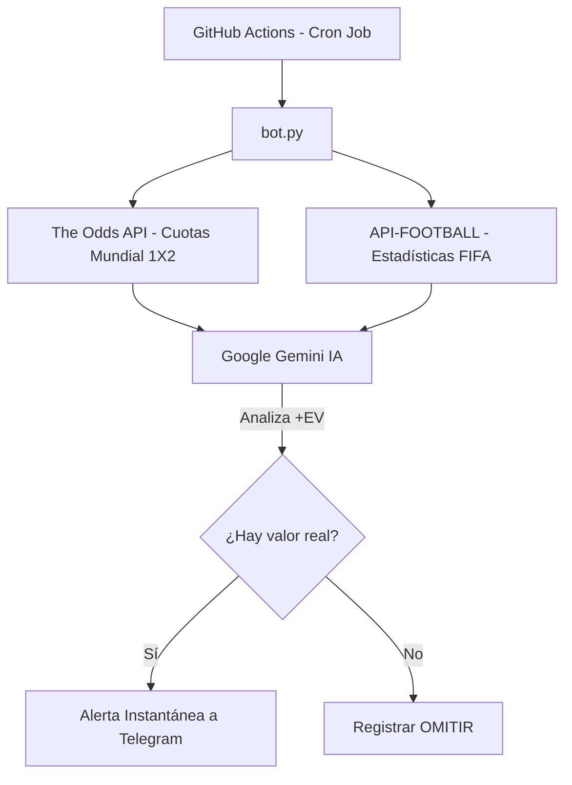

# 🏆 Bot de Apuestas IA - Copa Mundial FIFA 2026

Un sistema automatizado y cuantitativo desarrollado en Python para detectar apuestas con **Valor Esperado Positivo (+EV)** durante el Mundial 2026. El sistema se ejecuta en la nube sin costos de servidor y está diseñado para gestionarse 100% desde dispositivos móviles.

## 🚀 Características Reales
* **Cero Humo:** La Inteligencia Artificial actúa bajo reglas probabilísticas estrictas. Si no encuentra una discrepancia matemática a tu favor, descarta el partido.
* **Sin Servidor (Serverless):** Se ejecuta de forma automática cada hora utilizando entornos virtuales aislados en GitHub Actions.
* **Control Móvil:** Todo el despliegue, edición de estrategias y ejecución manual se realiza desde la interfaz web o app de GitHub en tu celular.
* **Análisis Cruzado:** Conecta cuotas del mercado global en tiempo real con estadísticas oficiales de la FIFA.

## ⚙️ Arquitectura del Sistema

## 🛠️ Configuración de Secretos en GitHub

Para que el bot funcione de forma segura sin exponer tus claves públicas, añade estas variables en **Settings > Secrets and variables > Actions**:

| Nombre del Secreto | Origen / Proveedor | Función |
| :--- | :--- | :--- |
| `TELEGRAM_TOKEN` | @BotFather | Token de autenticación de tu bot de Telegram. |
| `TELEGRAM_CHAT_ID` | @userinfobot | Tu ID numérico personal de Telegram. |
| `ODDS_API_KEY` | The Odds API | Acceso a cuotas actualizadas del Mundial. |
| `API_FOOTBALL_KEY` | API-Football (RapidAPI) | Datos y rendimiento histórico de las selecciones. |
| `GEMINI_API_KEY` | Google AI Studio | Modelo generativo para el procesamiento lógico +EV. |

## 📦 Archivos del Repositorio

* `bot.py`: Código principal. Extrae los JSON de las APIs, filtra los mercados del Mundial 2026 y realiza las consultas a Gemini.
* `requirements.txt`: Librerías necesarias de Python (`requests`).
* `.github/workflows/main.yml`: Automatización encargada de compilar el entorno y correr el bot cada hora en punto (`cron: '0 * * * *'`).

## 📲 Cómo Ejecutar Manualmente desde el Celular

Si hay partidos en juego y no deseas esperar al temporizador automático de una hora:
1. Entra a tu repositorio en el navegador de tu móvil.
2. Ve a la pestaña **Actions**.
3. Selecciona **Ejecucion Automatica Bot de Apuestas** en el menú de la izquierda.
4. Presiona el botón desplegable **Run workflow** y confirma en el botón verde.

## 📝 Descargo de Responsabilidad
Este script se proporciona exclusivamente con fines educativos y de análisis cuantitativo personal. El rendimiento pasado de cualquier modelo probabilístico no garantiza ganancias futuras. Apuesta de manera responsable.
